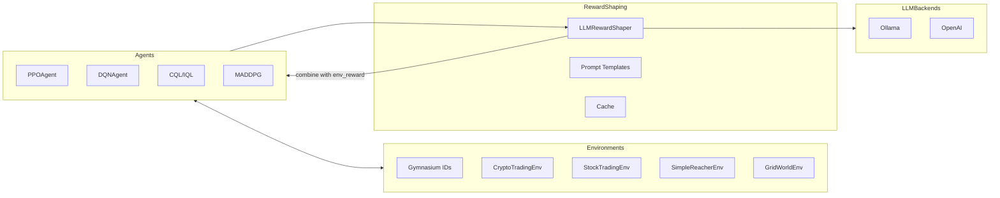

# Hugo: RL-LLM Toolkit

**Democratizing Reinforcement Learning with Large Language Models**

[](https://pypi.org/project/hugo-rl-llm/)
[](https://github.com/tonipcv/hugo/actions/workflows/ci.yml)
[](https://codecov.io/gh/tonipcv/hugo)
[](https://pepy.tech/project/hugo-rl-llm)
[](https://opensource.org/licenses/MIT)
[](https://www.python.org/downloads/)

## 🚀 Overview

RL-LLM Toolkit is an open-source framework that integrates Reinforcement Learning with Large Language Models to create intelligent agents accessible to beginners and researchers. By simulating human feedback via LLMs, we reduce RLHF costs by up to 50% while maintaining training quality.

### Key Features

- 🎮 **Gymnasium-Compatible Environments**: Easy-to-use RL environments for games, finance, and robotics
- 🤖 **LLM-Powered Rewards**: Generate dense rewards using local or API-based LLMs
- 📊 **State-of-the-Art Algorithms**: PPO, DQN, and more with modular architecture
- 🔧 **Plug-and-Play Design**: Swap algorithms, environments, and LLMs effortlessly
- 📚 **Educational Focus**: Interactive Jupyter notebooks and comprehensive tutorials
- 🌐 **Hugging Face Integration**: Share models and datasets with the community

## 🎯 Quick Start

```bash
# Install the toolkit from PyPI
pip install hugo-rl-llm

# Run the CLI
hugo --help

# Or run a simple example module
python -m rl_llm_toolkit.examples.cartpole
```

## 📦 Installation

### From PyPI

```bash
pip install hugo-rl-llm
```

### From Source

```bash
git clone https://github.com/tonipcv/hugo.git
cd hugo
pip install -e .
```

### Optional Dependencies

```bash
# For LLM integration
pip install -e ".[llm]"

# For development
pip install -e ".[dev]"

# For all features
pip install -e ".[all]"
```

## 💡 Usage Example

```python
from rl_llm_toolkit import RLEnvironment, PPOAgent, LLMRewardShaper
from rl_llm_toolkit.llm import OllamaBackend

# Create environment
env = RLEnvironment("CartPole-v1")

# Set up LLM-based reward shaping
llm = OllamaBackend(model="llama3")
reward_shaper = LLMRewardShaper(llm, prompt_template="custom_template")

# Train agent
agent = PPOAgent(env, reward_shaper=reward_shaper)
agent.train(total_timesteps=100000)

# Evaluate
agent.evaluate(episodes=10, render=True)
```

## 🏗️ Architecture



## ❓ Why Hugo?

- **LLM Rewards Nativos**: integração direta com Ollama e OpenAI, com templates prontos e cache.
- **Lean & Research-Oriented**: sem bloat; arquitetura clara, fácil de estender.
- **Domínios Diversos**: trading (cripto/ações), robótica (reacher) e gridworld prontos.
- **Benchmarks & Métricas**: estabilidade, eficiência amostral e performance assintótica.
- **Colaboração**: sessões e buffers compartilhados para cenários multiagente/experimentos.
- **CLI Produtiva**: descoberta (`list-*`), quickstart e validação (`--dry-run`).

Comparativo rápido:
- Stable-Baselines3: produção madura, porém sem LLM shaping nativo.
- TorchRL: poderoso e amplo; Hugo é mais direto para RL + LLM.
- OpenRLHF / RL4LMs: foco em LLMs; Hugo cobre RL clássico + LLM em vários domínios.

## 🎓 Examples

- **CartPole with LLM Feedback**: Train a classic control agent with GPT-4 reward shaping
- **Crypto Trading Bot**: Build a trading agent using historical data and LLM market analysis
- **Multi-Agent Game**: Coordinate multiple agents in a competitive environment

## 🤝 Contributing

We welcome contributions! See [CONTRIBUTING.md](CONTRIBUTING.md) for guidelines.

## 📊 Roadmap

### Now (0-3 months)
- ✅ Core RL framework with PPO/DQN
- ✅ Basic LLM integration (Ollama, OpenAI)
- 🔄 Interactive examples and tutorials
- 🔄 Comprehensive documentation

### Next (3-6 months)
- Offline RL support
- Financial trading environments
- Hugging Face model hub integration
- Community leaderboards

### Later (6-12 months)
- Real-time collaboration features
- Video reasoning integration
- Advanced multi-agent systems
- Research partnerships

## 📄 License

MIT License - see [LICENSE](LICENSE) for details.

## 🙏 Acknowledgments

Inspired by projects like PufferLib, Neural MMO, and the broader open-source RL community.

## 📬 Contact

- Issues: https://github.com/tonipcv/hugo/issues
- Discussions: https://github.com/tonipcv/hugo/discussions
- Email: contact@xaseai.com

---

**Star ⭐ this repo if you find it useful!**

Star History: https://star-history.com/#tonipcv/hugo
